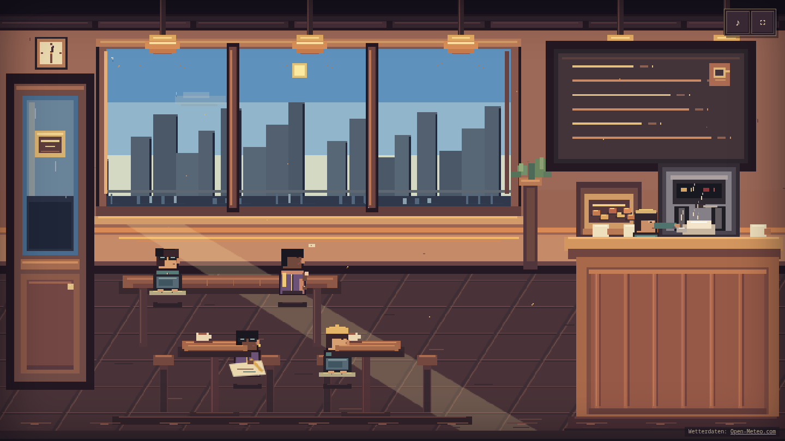

# Kaffeepause

Ein autonomes Pixel-Art-Diorama für eine kleine Pause im Browser.

**[Ort auswählen →](https://theanonymous.github.io/Kaffeepause/)**



## Über das Projekt

Kaffeepause beginnt mit einer Ortswahl: ein gemütliches Café, ein warmes Ramen-Restaurant oder eine ruhige Arcade-Halle. Alle drei Varianten teilen sich die autonome, kollisionsbewusste Gäste-Simulation, erhalten aber jeweils eigene Einrichtung, Palette, Theke, Lichtdetails und zurückhaltende Klangfarbe. Gerätezeit, Sonnenstand, Wetter und Tagesprofil verändern Außenwelt, Licht, Auslage, Geräuschkulisse und Belegung weich. Gäste kommen und gehen, bestellen, lesen, arbeiten, zeichnen, telefonieren, reden und trinken – vollständig selbstständig und ohne sichtbaren Schleifensprung. Wiederkehrende Stammgäste bringen ruhige Geschichten mit: Mara füllt und hängt eine Skizze auf, Noor und Toni verbringen einen ersten Abend miteinander, Linn verschenkt etwas Selbstgestricktes. Dazwischen verbinden kleine Alltagsmomente die Szene.

- handgezeichnete Canvas-Pixelart ohne externe Assets
- Auswahl zwischen Café, Ramen-Restaurant und Arcade-Halle vor dem Eintritt; keine nachträgliche Menühürde
- hochauflösendes 1152 × 648-Pixel-Canvas mit feineren Ein-Pixel-Details
- hochdichte 3×-Figurensprites mit Gesichtszügen, Haarsträhnen, Stoffnähten, Händen und lesbaren Requisiten
- bis zu acht Gäste mit lesbaren Tätigkeiten, Wetteraccessoires und einer detaillierten animierten Bedienung
- eine echte Eingangstür, die sich für ankommende und gehende Gäste am Simulations-Eingang öffnet und ruhig wieder schließt
- ortsspezifische, simulationsgebundene Requisiten: Espressomaschine, Küchenpass, Arcade-Screens sowie belegte Tische und Warteschlangen
- neun Gasttätigkeiten, darunter Tagebuchschreiben, Stricken und Brettspiel; Barista mahlt, verkostet und bedient
- sanfte, deterministische Café-Momente mit eigenen Bild- und Klangdetails, die nicht mit Unfällen kollidieren
- vier visuell wiedererkennbare Stammgäste mit seltenen, zusammenhängenden Mini-Geschichten
- funktionierende Pixel-Wanduhr sowie lokaler Sonnenstand mit Dämmerung und Polarzuständen
- klare, bewölkte, neblige, regnerische, verschneite und stürmische Außenwelten
- Passant:innen, Busse, Regenschirme, Vögel und saisonale Außenwelt hinter dem Fenster
- tageszeitabhängige Auslage, Stadtlichter, Sterne, gerichtetes Fensterlicht, nasse Reflexionen und warme Innenbeleuchtung
- deterministische Figuren-Zustandsautomaten und zentrale Platzreservierung
- kollisionsbewusste Routen um Theke, Tische und andere laufende Gäste
- schlanke Szenenlaufzeit mit unveränderlichen Snapshots zwischen Simulation und Canvas-Renderer
- seltene, vollständig reversible Café-Unfälle mit Tablett, Kaffeetasse oder Regenschirm
- adaptive Lo-fi-Musik, räumlicher Regen und Wind sowie seltene, belegungsabhängige Ortsgeräusche über Web Audio
- pixelartige Ton- und Vollbildsteuerung, die sich nach 2,5 Sekunden Ruhe zurückzieht
- langsame Kamerafahrt auf schmalen Smartphone-Displays
- Reduced-Motion-Modus mit ruhiger Kamera, statischem Wetter und weniger Partikeln
- rein clientseitig und ohne eigenes Backend

Nach dem Betreten lassen Mausbewegung, Berührung, Tastatur oder Fokus die Steuerung sofort wieder erscheinen. Im Vollbild bleibt ihr Zustand auch nach Escape korrekt synchronisiert. Alle vier bis sieben Minuten sorgt ein harmloser Slapstick-Moment kurz für Aufregung; danach setzen Barista und Gäste ihre gesicherten Tätigkeiten und Wege fort.

## Standort und Wetter

Beim Laden fragt Kaffeepause nach dem Browserstandort. Die Koordinaten bleiben ausschließlich im Arbeitsspeicher, werden für den Wetterabruf auf zwei Dezimalstellen gerundet und weder gespeichert noch rückwärts geokodiert. Bei Ablehnung, ungültigen Daten oder fehlendem Netz läuft das Café ohne Einschränkung mit einer deterministischen Ersatzumgebung weiter.

Live-Wetter stammt aus der keylosen [Open‑Meteo Forecast API](https://open-meteo.com/en/docs) und wird höchstens alle 15 Minuten aktualisiert. Die sichtbare Attribution im Café verweist auf [Open‑Meteo](https://open-meteo.com/); das Projekt nutzt dessen nichtkommerzielles Modell. Zeit, Standort und Wetter werden nicht an ein eigenes Backend übertragen.

## Lokal starten

```sh
npm install
npm run dev
```

## Prüfungen

```sh
npm test
npm run build
npm run test:e2e
```

Die Simulation verwendet stabile Szenenkoordinaten von 384 × 216. Gerendert wird auf einem intrinsischen 1152 × 648-Pixel-Canvas mit Faktor 3 und ohne Weichzeichnung. Auf Smartphones bleibt die Szenenhöhe erhalten; die intrinsische Canvasbreite und der sichtbare Kameraausschnitt werden gemeinsam angepasst.

Im Entwicklungsserver lassen sich visuelle Szenen mit `?time=HH:MM`, `?weather=clear|cloudy|fog|rain|snow|storm`, `?lat=<Breite>` und `?lon=<Länge>` kombinieren. Genau eine Unfallart kann zusätzlich beschleunigt werden, zum Beispiel mit `?accident=tray-drop`, `?accident=coffee-spill` oder `?accident=umbrella-pop`; ebenso ein Alltagsmoment mit `?moment=shared-cake|card-game|window-gaze|sketch-reveal` oder eine Stammgast-Geschichte mit `?story=sketchbook|first-date|knit-gift`. Produktionsbuilds ignorieren sämtliche Testparameter.
