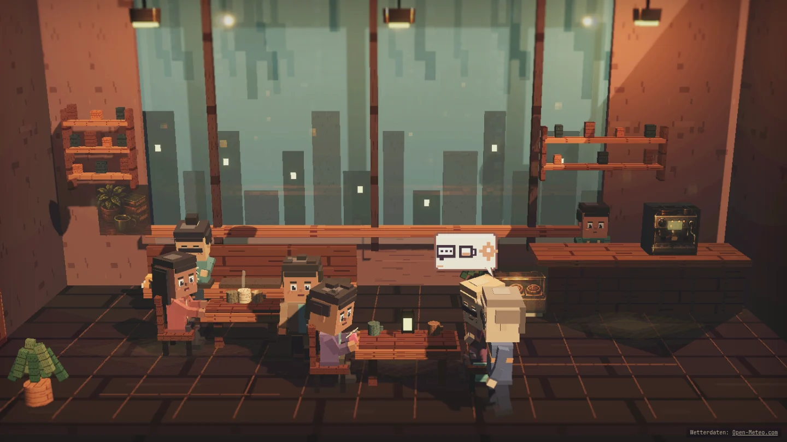

# Kaffeepause

Ein kleines Diorama aus Klötzchen zum Zuschauen – für mich und meine Freunde.

**[Kaffeepause öffnen →](https://games.jodie-oesterling.de/kaffeepause/)**



## Was passiert da?

Du suchst dir einen Ort aus: ein gemütliches Café, ein warmes Ramen-Restaurant oder eine ruhige Arcade-Halle. Danach läuft alles von selbst. Gäste kommen und gehen, bestellen, lesen, stricken, zeichnen, reden und spielen. Zwölf Stammgäste bringen kleine Geschichten mit, von Maras Skizzenbuch über eine vertauschte Bestellung bis zur widerspenstigen Nudel. Ab und zu passiert ein harmloses Missgeschick, und danach geht alles ruhig weiter.

- Kleine Untertitel erzählen, was gerade passiert.
- Tageszeit und Wetter verändern Licht, den Blick aus dem Fenster und die Geräusche; auch spät nachts sitzen noch ein paar Nachteulen da.
- Im Café wohnt Mochi, eine Katze. Sie schläft meistens auf der Fensterbank und schnurrt, wenn du sie mit der Maus streichelst.
- Um Halloween stehen Kürbisse herum, im Dezember hängen Lichterketten.
- Wenn du mit der Maus auf einer Figur verweilst, reagiert sie. Ein Klick auf einen Gast, und er winkt dir zu.
- Klick auf Mochi, und sie kommt zu dir. Die Klingel auf der Theke ruft die Bedienung, die dir etwas zu trinken reicht. Wer lange zuschaut, ohne etwas anzuklicken, bekommt einmal einen kleinen Tipp dazu.
- Lo-fi-Musik und Raumklang lassen sich ausschalten; es gibt einen Vollbildmodus. Der Knopf mit den Pfeilen führt zurück zur Ortswahl, mit dem nächsten Ort schon ausgewählt.
- Der Link zeigt in Chats eine Vorschau, und auf dem Handy lässt sich die Seite zum Startbildschirm hinzufügen.
- Das Bild passt sich jedem Fenster an, ohne Figuren zu quetschen: Breite Fenster zeigen den ganzen Raum, sehr schmale (Handy, Tablet hochkant) einen Ausschnitt, durch den die Kamera langsam fährt. Bei reduzierter Bewegung bleibt sie still.

Mit einem Direktlink landet man gleich am richtigen Ort: [#cafe](https://games.jodie-oesterling.de/kaffeepause/#cafe), [#ramen](https://games.jodie-oesterling.de/kaffeepause/#ramen) oder [#arcade](https://games.jodie-oesterling.de/kaffeepause/#arcade).

## Freunde als Stammgäste

In [`src/friends.ts`](src/friends.ts) lassen sich Freunde eintragen: Name, Lieblingsort, typische Beschäftigung und nach Wunsch Frisur, Haar- und Kleidungsfarbe, Brille oder Bart. Sie kommen dann bevorzugt vorbei, und ein Untertitel sagt Bescheid, wenn jemand hereinkommt.

```ts
export const FRIENDS: readonly Friend[] = [
  { name: 'Sam', venue: 'ramen', activity: 'journaling', hair: 'curls', hairColor: '#3a2a22', outfitColor: '#4f7c68', detail: 'glasses' },
];
```

## Standort und Wetter

Beim Laden fragt Kaffeepause nach dem Browserstandort. Die Koordinaten bleiben ausschließlich im Arbeitsspeicher, werden für den Wetterabruf auf zwei Dezimalstellen gerundet und weder gespeichert noch rückwärts geokodiert. Bei Ablehnung, ungültigen Daten oder fehlendem Netz läuft das Café ohne Einschränkung mit einer Ersatzumgebung weiter.

Live-Wetter stammt aus der keylosen [Open‑Meteo Forecast API](https://open-meteo.com/en/docs) und wird höchstens alle 15 Minuten aktualisiert. Die sichtbare Attribution im Café verweist auf [Open‑Meteo](https://open-meteo.com/); das Projekt nutzt dessen nichtkommerzielles Modell. Zeit, Standort und Wetter gehen an kein eigenes Backend.

## Lokal starten

```sh
npm install
npm run dev
```

## Prüfen und veröffentlichen

```sh
npm run check     # Unit-Tests, Build, Rauchtest und Browser-Tests
npm run release   # prüft alles und veröffentlicht nach Rückfrage
```

`npm run release -- --rollback` schaltet auf das vorherige Release zurück. Die Browser-Tests legen Bilder aller Orte zu mehreren Tageszeiten in `look/` ab, so lässt sich eine Änderung am Licht direkt ansehen.

Wie der Code aufgebaut ist und welche Testparameter es gibt, steht in [docs/ENTWICKLUNG.md](docs/ENTWICKLUNG.md).

<!-- github-cicd-policy -->
## Local validation policy

This repository does not use GitHub Actions or any other GitHub-hosted CI/CD. Run tests, linters, builds, and all other checks locally before merging. A documented successful local test run is sufficient for review and merge.
<!-- /github-cicd-policy -->
